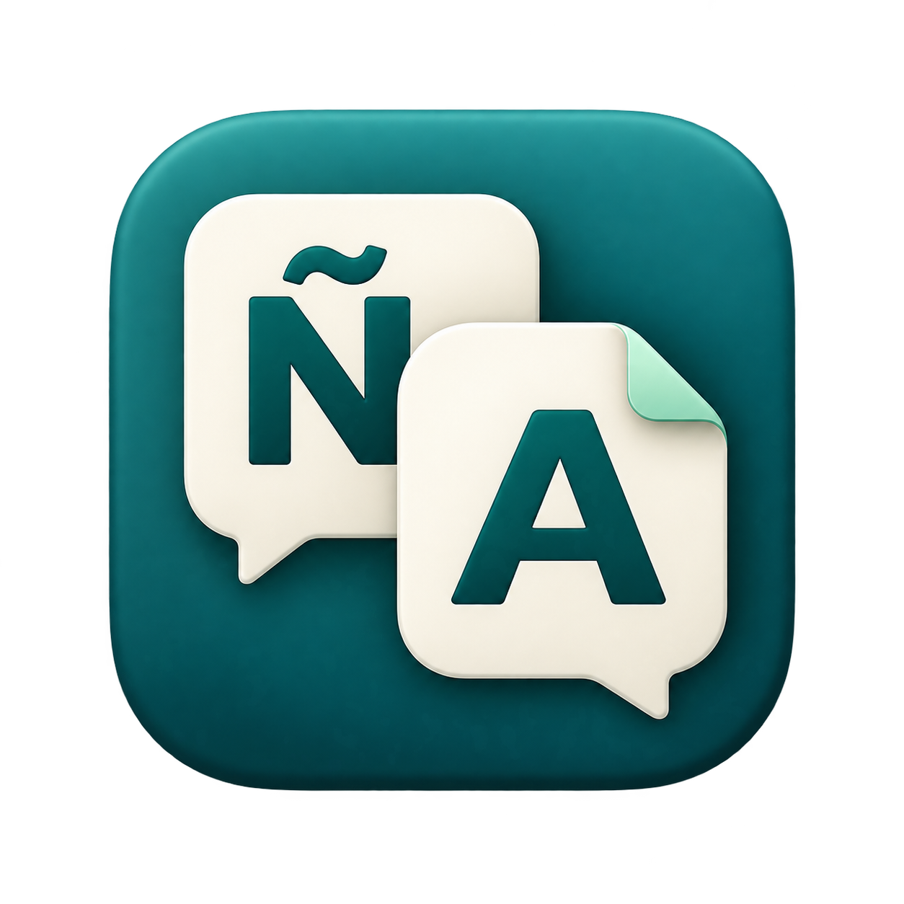

<p align="center"></p>

# CopyToTranslate

**Copy Spanish. Read English. Stay in your flow.**

A small macOS menu bar app that automatically translates copied Spanish text into English in a quiet corner of your screen. Language detection and translation run on your Mac using Apple's Natural Language and Translation frameworks.

**Development version 1.1.0:** this branch also includes a **§** selection shortcut for Spanish translation and Dutch proofreading. The published **v1.0.0** download supports Spanish translation; Dutch proofreading is currently available by building this branch.

[Download the latest release](https://github.com/emielvangoor/CopyToTranslate/releases/latest) · [Release notes](https://github.com/emielvangoor/CopyToTranslate/releases) · [Report an issue](https://github.com/emielvangoor/CopyToTranslate/issues)


[](https://github.com/emielvangoor/CopyToTranslate/actions/workflows/build.yml)
[](LICENSE)

## What it does

- **Automatic Spanish detection.** Copy a Spanish passage in any app to see its English translation. Emoji are ignored for detection and preserved in the text sent to translation.
- **A quiet translation card.** Appears at the top right without taking keyboard focus. Longer translations scroll.
- **Copy English.** Copies the full translation when you click it. Automatic translation leaves your original clipboard unchanged.
- **Dutch proofreading on demand.** Select a Dutch sentence or email, then press **§** to proofread with GPT-5.4 nano through OpenRouter. Choose **Corrected** for minimal edits or **Improved phrasing** for a smoother version. Each has its own copy action. Dutch copying alone never runs the model.
- **Select and press §.** With Accessibility permission, the shortcut reads selected text directly. On-device classification routes Spanish to English translation and Dutch to proofreading. With no selection, supported text fields use the clipboard.
- **Five-second countdown.** A shrinking ring shows the remaining reading time. Hover to pause; move away to resume. Respects Reduce Motion.
- **Menu bar controls.** Pause or resume, translate ambiguous text manually, try an example, or open Setup.
- **Launch at login.** An optional Setup switch starts the app quietly when you sign in.

Spanish translation needs no account or API key. Optional Dutch proofreading uses your OpenRouter API key and credit.

## Install

Requires an **Apple silicon Mac (M-series)** running **macOS 15 Sequoia or later**. The downloadable build is arm64; Intel Macs are not currently a supported release target.

1. Download the `.zip` from the [latest release](https://github.com/emielvangoor/CopyToTranslate/releases/latest).
2. Unzip it and move **CopyToTranslate.app** into **Applications** before opening it.
3. Open the app and click **Enable Translation**. Approve Apple's Spanish and English language downloads if prompted. This one-time download needs an internet connection.
4. Allow clipboard access if macOS asks, then copy a Spanish sentence or click **Try Example**.
5. Turn on **Launch at login** in Setup if you want automatic startup.

The app lives in the menu bar and has no Dock icon. Closing Setup keeps it running.

### First launch and macOS security

These initial releases are ad-hoc signed and **not notarized by Apple**, so macOS may block the first launch. If you trust this download, try opening it once, then use **System Settings → Privacy & Security → Open Anyway**. See [Apple's instructions](https://support.apple.com/en-us/102445). You can also build from source below.

### Updating

Quit CopyToTranslate from its menu, replace the app in Applications with the new version, and reopen it. Check **Setup → Launch at login** after updating. Language models are managed by macOS. There is no built-in updater.

## Everyday use

Copy something like:

> La reunión se ha cambiado al jueves a las diez.

The card shows an English translation. Keep working, hover to read longer, or click **Copy English** to use the result elsewhere.

For short or ambiguous phrases, choose **Translate Clipboard as Spanish** from the menu bar. Use **Pause Translation** whenever you want copying to stay quiet.

### Dutch proofreading (development version)

1. Create an [OpenRouter API key](https://openrouter.ai/settings/keys) with credit and a spending limit suitable for your usage.
2. In CopyToTranslate Setup, expand **Add OpenRouter API key**, paste the key and click **Save key**. The app stores it in macOS Keychain on this Mac; it never embeds it in the app or repository. The field clears after saving. Use **Remove key** to delete it later.
3. Turn on **Translate or correct selected text · §** and use **Check setup**. Click **Allow…** to enable CopyToTranslate in **System Settings → Privacy & Security → Accessibility**. Restart the app if permission is still reported as missing after approval.
4. Select text in your app, then press the bare **§** key. Spanish is translated to English on-device; Dutch is corrected through OpenRouter. No Command, Option or Control is needed. With nothing selected in a supported text field, the same classifier uses your clipboard. The menu also offers **Translate or Correct Selection (§)** and explicit Spanish/Dutch clipboard commands.
5. Switch between **Corrected** and **Improved phrasing**, then click **Copy corrected** or **Copy improved**. Paste the result wherever you were writing.

Only an explicit proofreading request sends that passage to OpenRouter and its OpenAI provider. Normal copying and language detection remain local. Internet access is required for Dutch proofreading; there is no automatic cloud fallback for Spanish.

The shortcut reserves the ISO section key (the § key on a Dutch Mac keyboard) while the selection shortcut is enabled. Disable the shortcut switch to type with that key normally. Other keyboard layouts may print a different character on the same physical key. Shortcut conflicts appear in Setup, and the menu command remains available.

Dutch proofreading is explicit and still works while automatic Spanish translation is paused. It skips likely code, names, fragments and uncertain language matches. Selected text is read through macOS Accessibility only on request. Ordinary text fields are read directly without changing the clipboard. Password fields are rejected. If permission is missing or an app does not expose its selection, a visible card points to Setup or the explicit clipboard menu commands; it does not send unrelated clipboard text. The clipboard commands work without Accessibility permission. Ollama and a local model download are no longer needed.

**WhatsApp messages:** highlight text inside one message, leave the pointer over that highlight, and press **§**. WhatsApp keeps message selection separate from its compose field, so the shortcut uses the highlight's Copy action when direct selection access is unavailable. This puts the selected source text on your clipboard. The app checks it against the message under the pointer before classification. An unavailable message selection shows guidance instead of falling back to an old clipboard item. You can also right-click the highlight and choose **Copy**, then use an explicit clipboard command from the app menu.

The five-second reading countdown begins when both results are ready. Hover to pause it. The nine synthetic evaluation requests took about 1–3 seconds each and cost approximately $0.0014 in total; actual latency and usage cost vary with the text and model behavior. Both versions may be identical when the corrected text already reads naturally. Review suggestions before using them; models can still miss errors or change wording more than intended.

## Privacy and limits

- Detection and Spanish translation run on-device. Dutch proofreading uses `openai/gpt-5.4-nano` through `https://openrouter.ai`. The app blocks redirects and restricts requests to OpenAI with OpenRouter’s no-training provider filter. This is not a zero-data-retention guarantee; see [OpenRouter’s provider policies](https://openrouter.ai/docs/guides/privacy/provider-logging). There is no analytics or clipboard history in the app.
- The app does not save copied text or results to files, logs or preferences. Text is held for the current card and in-flight processing. Dutch text passes through OpenRouter and OpenAI under their data policies. API keys are stored in Keychain and never shown again after saving.
- Empty/non-text items, standalone URLs and email addresses, and selections over 10,000 characters are skipped. Uncertain automatic language detection stays quiet; the shortcut shows guidance when it cannot classify the passage.
- Recognized confidential/transient clipboard markers are skipped. Not all apps mark sensitive text, so these markers are not a complete sensitive-content filter.
- Startup, resume, and wake ignore existing clipboard content. Only subsequent clipboard changes are watched.
- New clipboard content dismisses the previous card. The app's own copy buttons do not trigger another translation or correction.
- Sleep, screen lock, and inactive sessions suspend monitoring and hide the card. A floating card is an app window, so Focus does not automatically suppress it.
- Apple's translation quality can vary, particularly for slang and short phrases. Translation is fixed to Spanish → English; proofreading remains in Dutch. Dutch output is checked for changed numbers, links and email addresses before it becomes copyable.

## Troubleshooting

| Problem | What to try |
| --- | --- |
| Nothing happens when copying | Check that translation is enabled and not paused. Try a complete Spanish sentence or **Test Translation** from the menu. |
| Short words are missed | Choose **Translate Clipboard as Spanish** to bypass automatic detection. |
| Language downloads are needed | Open **Setup → Prepare Languages** and let the downloads finish. |
| Clipboard access is needed | Allow CopyToTranslate's clipboard access in macOS settings where available, then enable translation again. |
| Automatic startup needs approval | Use **Open Login Items Settings** in Setup and allow the app there. |
| Translation fails | Copy the passage again, or open Setup to recheck language preparation. The original clipboard remains available. |
| Dutch copying does nothing | Select a full Dutch sentence or email, then press **§**, or use **Correct Dutch Clipboard**. Dutch proofreading is on demand. |
| Selected text is unavailable | Allow Accessibility access in Setup. Restart after changing permission if needed. If the switch is already on but the app still reports denied access after an update, remove CopyToTranslate from the Accessibility list with **−**, then add the current app with **+** and enable it again. Some apps do not expose selections; use the explicit clipboard menu command instead. |
| Dutch model is unavailable | Check your internet connection, OpenRouter credit/key limits and provider privacy settings, then choose **Check setup**. |
| § is unavailable | Free the key in another app, then disable and re-enable the shortcut switch. The menu command also works. |

## Build from source

Use Xcode with the macOS SDK and **Swift 6**. The Swift package has no third-party dependencies. Optional Dutch proofreading needs an OpenRouter API key; there is no Ollama dependency.

```sh
git clone https://github.com/emielvangoor/CopyToTranslate.git
cd CopyToTranslate
git switch codex/dutch-proofreading
env -u LIBRARY_PATH swift test
./scripts/build-app.sh
open build/CopyToTranslate.app
```

The build script creates an app for the current Mac's architecture. It defaults to ad-hoc signing. For stable Accessibility permission across local updates, set `CODE_SIGN_IDENTITY` to your Apple signing certificate's name or SHA-1 fingerprint, or put the fingerprint in the ignored `.signing-identity` file. Ad-hoc rebuilds can require refreshing Accessibility permission because their identity changes. Keep it at its registered location if you enable launch at login, or move it to Applications before enabling that setting.

Tests use private pasteboards and leave your clipboard untouched. They cover language detection, emoji handling, clipboard changes and preservation, confidential markers, immediate shortcut/poll ordering, copy suppression, corrected/improved selection, stale-result cancellation, structured Dutch responses, protected tokens, countdown pause/resume, and overlapping suspension events. Keychain lifecycle and API failures are tested with isolated credentials and a stub transport. Actual model output and UI are checked manually; see [verification notes](docs/verification.md).

## Releases

Tagged releases include the app ZIP and its SHA-256 checksum. GitHub also provides source archives. To verify a downloaded ZIP, put it and its `.sha256` file in the same folder and run:

```sh
shasum -a 256 -c CopyToTranslate-v1.0.0-macos-arm64.zip.sha256
```

Use the filename for your downloaded version. Maintainers can follow the [release guide](docs/releasing.md) to publish another version. Pull requests and pushes to `main` also run the tests and package verification in GitHub Actions.

## License

[MIT](LICENSE) © 2026 Emiel van Goor.
